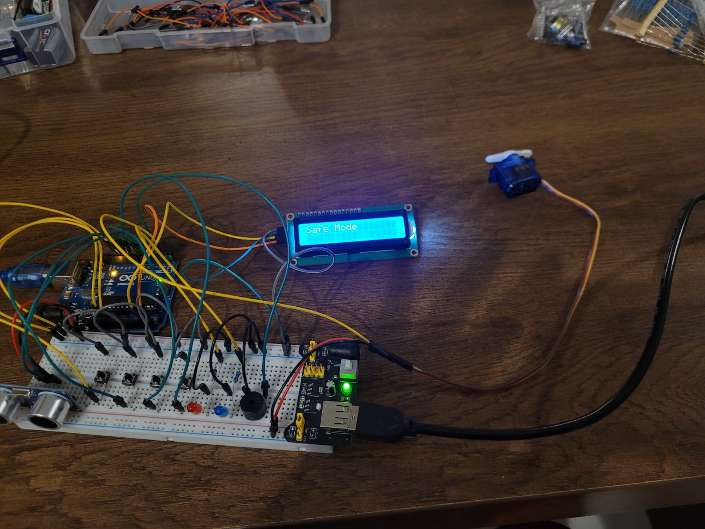
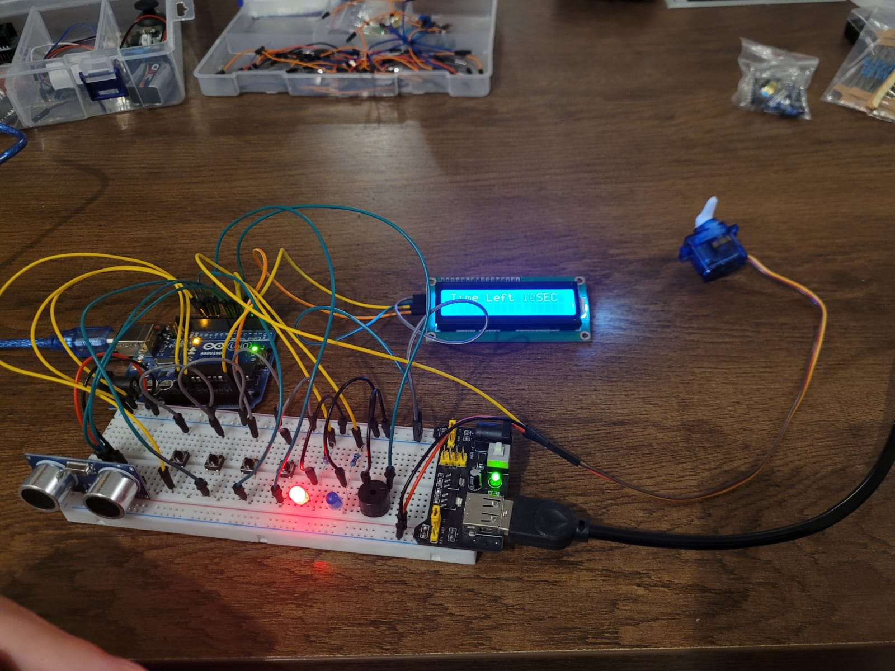
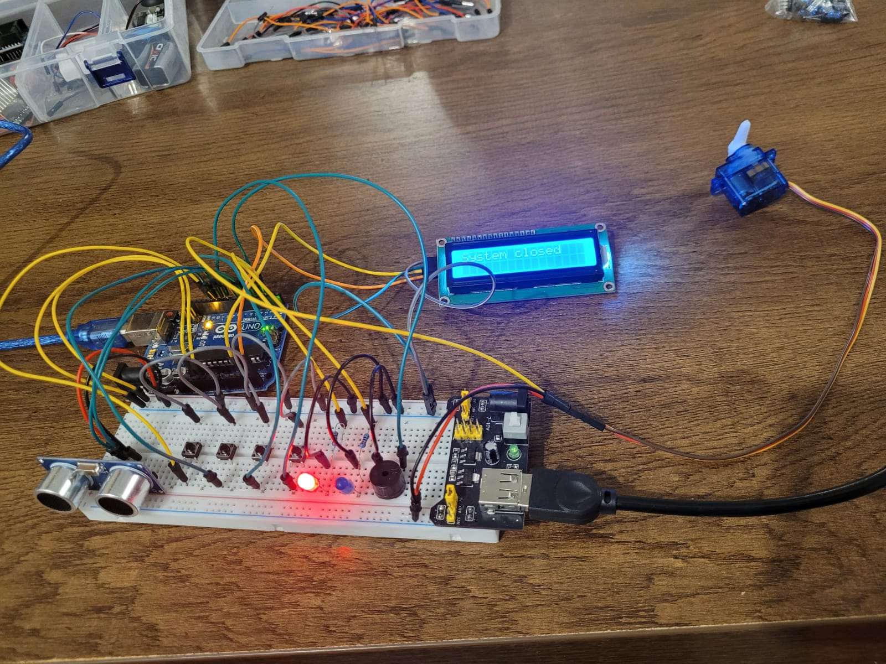
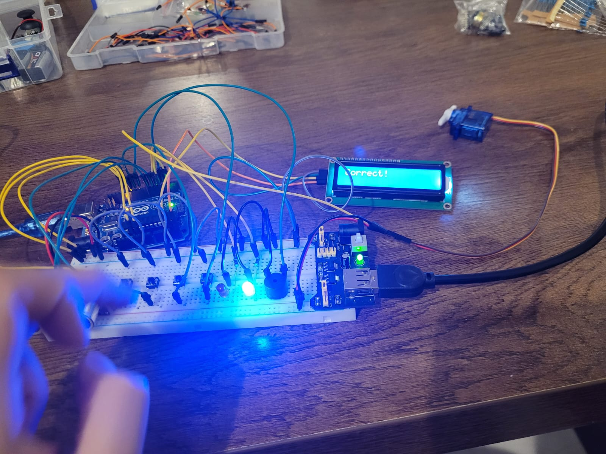
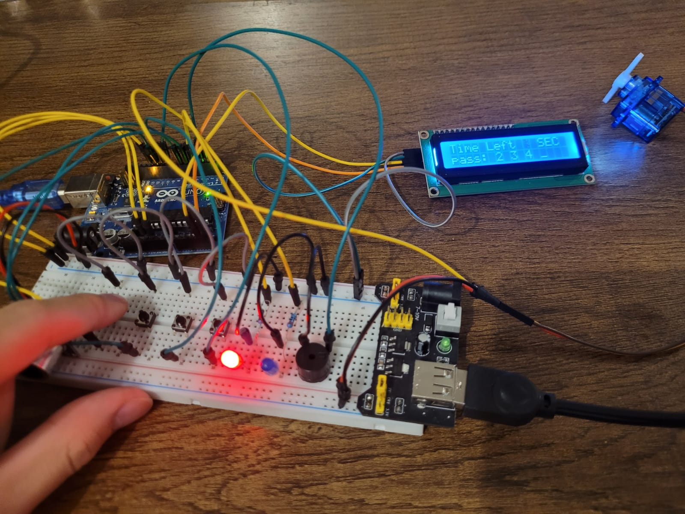

# Arduino---alert-timer

# Description:
Arduino---Security-System-with-Keypad-and-Countdown

This Arduino project simulates a security system using:

Ultrasonic sensor

4 push buttons (used as a keypad)

Servo motor

LCD screen

Red and blue LEDs

Buzzer

---

Safe Mode:

The system begins in Safe Mode, which is displayed on the LCD.

The servo motor stays at 0°, representing an unlocked door.

---

Alert Mode (Intrusion Detected):

When the ultrasonic sensor detects an object within a specific distance, the system switches to Alert Mode.

The servo motor rotates to 90°, simulating a locked door.

A 10-second countdown starts and is shown on the LCD, along with the code digits being entered by the user.

The red LED turns ON and stays ON during the entire countdown.


> The 4 push buttons are numbered from right to left as:
1 (far right), 2, 3, 4 (far left)

---

During the Countdown:

The user must enter the correct 4-digit password before the countdown ends.

If the password is correct:

The blue LED turns ON

The LCD displays: "Correct"

The servo returns to 0°

The system goes back to Safe Mode


If the password is incorrect:

A buzzer sound is played as a warning

The user can try again, but the countdown continues and is not reset

---

If Time Runs Out Without a Correct Code:

The red LED starts blinking

A long buzzer alert is activated

LCD shows: "System Closed"

The system is locked and cannot be used again

The user must press the Arduino reset button to restart the system

---

What You Learn from This Project:

Implementing a real-time countdown

Writing security logic using password validation

Working with servo motors for locking mechanisms

Reading input from buttons and sensors

Displaying data on an LCD

Providing visual and sound feedback for system status

Using millis() instead of delay() to measure time without blocking other code — keeping the program responsive while managing countdowns or parallel events.


# Pictures:

;





```cpp
#include <LiquidCrystal_I2C.h>
#include <Servo.h>

Servo servo;
LiquidCrystal_I2C lcd(0x27, 16, 2);


byte buzzer = 3;
byte blueLED = 4;
byte redLED = 5;
byte echo = 6;
byte trig = 7;
byte btn1 = 9;
byte btn2 = 10;
byte btn3 = 11;
byte btn4 = 12;
byte count = 0;


int lastTime = 0;
unsigned long travelTime;
int distance;
int timeOut;
byte angl1;
int btn1Value;
int btn2Value;
int btn3Value;
int btn4Value;
unsigned long lastTimePressed;

bool checkDone = true;

byte clickedButtons[4];
byte rightButtons[4] = {2,4,1,3};


void correctSignal() {
  digitalWrite(blueLED, HIGH);
  tone(buzzer, 700, 1000);
  digitalWrite(blueLED, LOW);
}


void putNumberOnLCD(byte num, byte index) {
  switch(index) {
    case 1:
      lcd.setCursor(6, 1);
      lcd.print(' ');
      lcd.setCursor(6, 1);
      lcd.print(num);
      break;
      
    case 2:
      lcd.setCursor(8, 1);
      lcd.print(' ');
      lcd.setCursor(8, 1);
      lcd.print(num);
      break;

    case 3:
      lcd.setCursor(10, 1);
      lcd.print(' ');
      lcd.setCursor(10, 1);
      lcd.print(num);
      break;

    case 4:
      lcd.setCursor(12, 1);
      lcd.print(' ');
      lcd.setCursor(12, 1);
      lcd.print(num);
      break;

  }
}


void setup() {
  Serial.begin(9600);
  servo.attach(2);
  lcd.init();
  lcd.backlight();
  pinMode(buzzer, OUTPUT);
  pinMode(blueLED, OUTPUT);
  pinMode(redLED, OUTPUT);
  pinMode(trig, OUTPUT);
  pinMode(echo, INPUT);

  for (byte i=9; i<13; i++){ // setup buttons
    pinMode(i, INPUT_PULLUP);
  }
  
  servo.write(0);
  delay(1000);
}

void loop() {
  lcd.clear();
  lcd.print("Safe Mode");

  digitalWrite(trig, LOW);
  delayMicroseconds(10);
  digitalWrite(trig, HIGH);
  delayMicroseconds(5);
  digitalWrite(trig, LOW);

  travelTime = pulseIn(echo, HIGH);

  distance = (travelTime / 2) * 0.0343;

  if (distance < 10) {
    digitalWrite(redLED, HIGH);
    tone(buzzer, 700, 1000);

    lastTime = millis();

    lcd.clear();
    lcd.print("Time Left");
    lcd.print("   SEC");
    lcd.setCursor(0, 1);
    lcd.print("pass: _ _ _ _");
    
    servo.write(90);
    
    while ((millis() - lastTime) / 1000 < 10.050){
      checkDone = true;

      lcd.setCursor(9, 0);
      lcd.print("   ");
      lcd.setCursor(10, 0);
      lcd.print(10 - timeOut);
      

      timeOut = (millis() - lastTime) / 1000;

      btn1Value = digitalRead(btn1);
      btn2Value = digitalRead(btn2);
      btn3Value = digitalRead(btn3);
      btn4Value = digitalRead(btn4);

      if (count < 4) {
        if (millis() - lastTimePressed > 200){  // check no repeat
          if (btn1Value == LOW) {
            clickedButtons[count] = 1;
            tone(buzzer, 600, 300);
            lastTimePressed = millis();
            count++;
            putNumberOnLCD(1, count);
          }
          
          if (btn2Value == LOW) {
            clickedButtons[count] = 2;
            tone(buzzer, 600, 300);
            lastTimePressed = millis();
            count++;
            putNumberOnLCD(2, count);
          }
          
          if (btn3Value == LOW) {
            clickedButtons[count] = 3;
            tone(buzzer, 600, 300);
            lastTimePressed = millis();
            count++;
            putNumberOnLCD(3, count);
          }

          if (btn4Value == LOW) {
            clickedButtons[count] = 4;
            tone(buzzer, 600, 300);
            lastTimePressed = millis();
            count++;
            putNumberOnLCD(4, count);
          }

        }

      } 

      else{ // Start check
        lcd.setCursor(0, 0);

        for (byte z=0; z<4; z++) {
          if (clickedButtons[z] != rightButtons[z]){
            checkDone = false;
            count = 0;
            break;
          }
        }

        if (checkDone) { // if passward correct
          lcd.clear();
          lcd.print("Correct!");
          digitalWrite(redLED, LOW);
          servo.write(0);

          for (byte time=0; time<2; time++) {
            digitalWrite(blueLED, HIGH);
            tone(buzzer, 700);
            delay(300);
            digitalWrite(blueLED, LOW);
            noTone(buzzer);
            delay(300);
          }

          break; // if passward correct get out of loop
        }

        else{ // if pasward wasnt correct
          tone(buzzer, 700, 1000);
          count = 0;
          lcd.setCursor(6, 1);
          lcd.print("       ");
          lcd.setCursor(6, 1);
          lcd.print("_ _ _ _");
        }

      }

    } // End while loop

    if (timeOut > 10) {
      lcd.clear();
      lcd.print("System closed");

      for (byte z=0; z<3; z++) {
        digitalWrite(redLED, LOW);
        tone(buzzer, 700, 1000);
        delay(500);
        digitalWrite(redLED, HIGH);
        delay(500);
      }
      while (true); delay(1000);
    }

  }

  count = 0; 

  delay(200);
}


```
